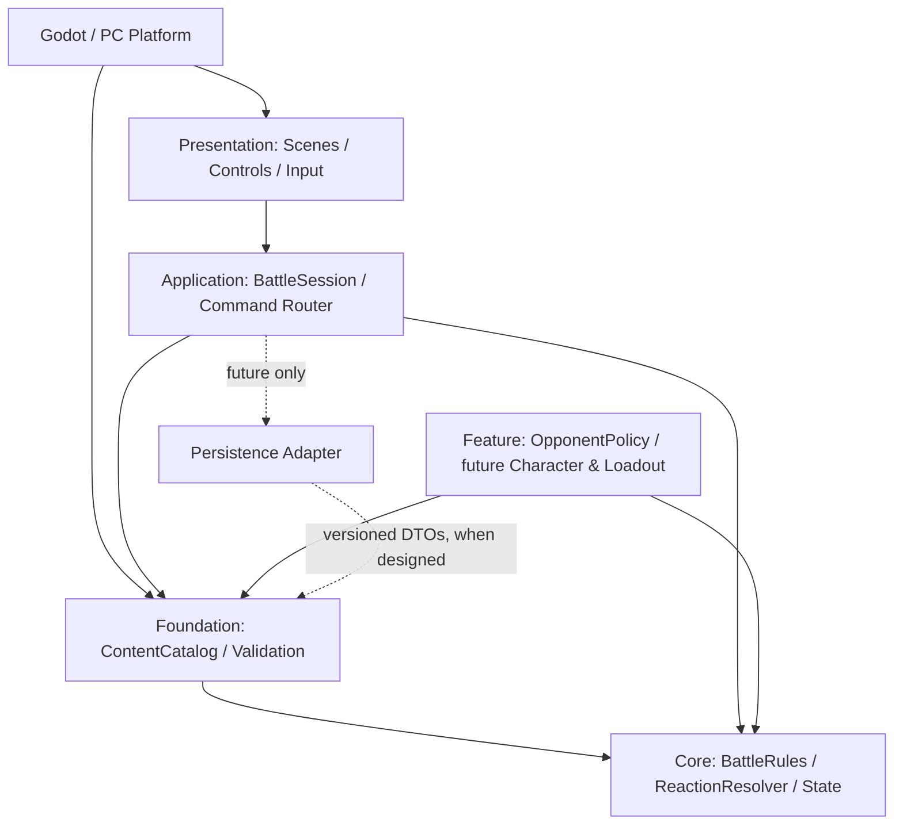
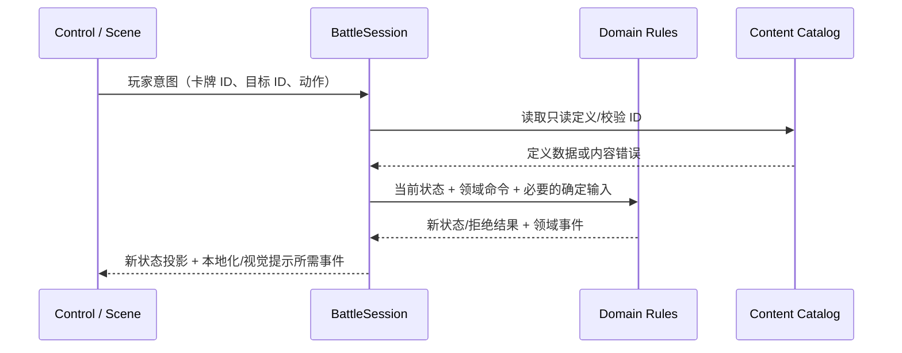

# TCA — 主架构蓝图

## 文档状态

- **版本：** 0.2（提案；已同步单场 MT-01–MT-10 基线）
- **更新日期：** 2026-10-07
- **引擎：** Godot 4.6.2；GDScript；2D Forward+；Godot Physics 2D
- **设计输入：** [`game-concept.md`](../../design/gdd/game-concept.md)（Draft）、[`combat.md`](../../design/gdd/combat.md)（Draft）、[`systems-index.md`](../../design/gdd/systems-index.md)（Draft）
- **战斗 GDD：** `combat.md` 仍为 Draft；MT-01–MT-10 为本次单场 Godot 切片的临时规则与输入实现基线，足以开工，不构成正式产品规则批准。
- **审计依据：** [`rule-parity-matrix.md`](../migration/rule-parity-matrix.md)、[`unity-to-godot-plan.md`](../migration/unity-to-godot-plan.md)
- **关联 ADR：** [ADR-0001](adr-0001-data-driven-card-and-reaction-content.md)、[ADR-0002](adr-0002-pure-rules-core-and-application-boundary.md)、[ADR-0003](adr-0003-persistence-boundary.md)、[ADR-0004](adr-0004-godot-scenes-and-input-responsibility.md)
- **接受状态：** 架构与 ADR 均为 Proposed；概念 GDD 和系统索引尚未通过独立审查。本文不是实现完成或 QA 通过的证明。

## 范围与成熟度

本文为迁移到 Godot 的单场战斗纵切片定义模块责任、数据方向和测试边界。Unity 2022.3/Tuanjie 项目及当前可执行行为继续作为迁移期参照；除已批准的新 Godot 工程配置外，不据此删除或改写 Unity 基线。

当前单场 Godot 切片包含卡牌/手牌、战斗状态、回合与能量、元素反应、确定性对手和战斗结果，以及键鼠优先的战斗 UI。战斗 GDD 的 MT-01–MT-10 为该切片提供可执行的临时规则和输入基线；规则缺口不再阻塞切片实现。冒险、成长、完整 14 人阵容、有机化学和正式产品平衡仍在切片之外。

概念 GDD、战斗 GDD 与系统索引均为 Draft，尚未通过独立审查。MT-01–MT-10 是明确记录的迁移期暂定规则，供当前切片实现和 QA 使用，不代表正式产品规则定案。架构与四份 ADR 仍为 Proposed，表示技术提案尚未逐条获负责人接受；它们不得被描述为用户逐条签收，也不抹去切片已有的实现基线。

## 引擎知识与核验边界

[`VERSION.md`](../engine-reference/godot/VERSION.md) 将目标记录为 Godot 4.6.2，发布日期 2026-04-01，知识截止 2026-05，风险等级 LOW。当前本地引擎参考目录只有 `VERSION.md`；模板要求的 `breaking-changes.md`、`deprecated-apis.md`、`current-best-practices.md` 及模块级参考尚未落入仓库。因此本文没有声称完成这些缺失文档的审阅。

本提案按官方 Godot 4.6 文档核对了涉及的概念：[`Resource`](https://docs.godotengine.org/en/4.6/classes/class_resource.html)、[`ResourceLoader`](https://docs.godotengine.org/en/4.6/classes/class_resourceloader.html)、[`ResourceSaver`](https://docs.godotengine.org/en/4.6/classes/class_resourcesaver.html)、[`Input`](https://docs.godotengine.org/en/4.6/classes/class_input.html)、[`Control`](https://docs.godotengine.org/en/4.6/classes/class_control.html)、[UI 控件与键盘/控制器导航](https://docs.godotengine.org/en/4.6/tutorials/ui/)、[`FileAccess`](https://docs.godotengine.org/en/4.6/classes/class_fileaccess.html) 和[存档概览](https://docs.godotengine.org/en/4.6/tutorials/io/)。这是文档层面的设计核对，不等于已用本机 4.6.2 编译、导入或运行过这些接口。每个实现故事仍须在目标二进制上验证；ADR 分别列出验证点。

| 领域 | 风险 | 架构影响 | 当前证据/缺口 |
|---|---|---|---|
| Core、Resource 数据 | LOW | 资源作为静态内容容器；领域状态与资源定义分开 | 官方 4.6 `Resource` / `ResourceLoader` 文档已查阅；本项目尚无内容加载代码 |
| UI、Input | LOW | Godot `Control` 场景呈现界面；输入映射转换为应用命令 | 官方 4.6 `Input`、`Control`、UI 文档已查阅；焦点顺序和游戏内操作未实现 |
| Persistence | LOW | 存档边界只做预留，首个纵切片不启用存档 | 官方 `FileAccess` 文档说明可使用 `user://`；本项目没有存档需求或实现 |
| Rendering / 2D Physics | LOW | 采用已确认的 Forward+ 配置；不把卡牌交互默认建模为物理碰撞 | `VERSION.md` 记录 Forward+ / Godot Physics 2D；实际场景、统计口径尚未验证 |

本文不提出渲染、网络或音频的特殊 API。项目没有联网系统；本切片也不要求 2D 碰撞模拟。任何未来新增域应先补齐该域的 Godot 4.6 参考并在实现中验证。

## 技术需求基线

编写本版时，`design/gdd/` 有三个 Markdown 输入：`game-concept.md` 和 `combat.md` 两份 GDD，以及 `systems-index.md` 系统索引。下表提取两份 Draft GDD 的技术要求，并标注来源成熟度；系统索引的系统拆分另在下节追踪。迁移矩阵是原型证据，不是已批准的新玩法规范。**基线：2 份 GDD，23 条技术需求（概念 11 条、战斗 12 条）；3 份设计输入均为 Draft。**

| Req ID | 来源 | 系统 | 技术要求 | 领域 | 架构响应 |
|---|---|---|---|---|---|
| TR-game-concept-001 | game-concept.md §产品身份 | 项目平台 | Godot 4.6.2、GDScript、2D、PC（Steam / Epic）；Forward+ 与 Godot Physics 2D 为已确认配置 | Platform / Rendering | 将引擎适配留在 Platform；场景和资源以 Godot 项目组织；不把商店集成视为已完成 |
| TR-game-concept-002 | game-concept.md §产品身份 | 战斗输入 | 键鼠为主、部分手柄、无触控；每项关键操作至少有一条由键盘、鼠标或二者组合完成的路径 | Input / UI | 输入适配层调用应用命令；每项关键操作有键盘/鼠标路径；不要求同一动作分别提供键盘与鼠标两套入口；拖放不作唯一方式 |
| TR-game-concept-003 | game-concept.md §核心体验 | Card Catalog | 伤害、Buff、溶剂是内部用途类别；不向玩家显示类别标签 | Content / UI | 类型用于规则/校验，Presentation 仅显示面向玩家的名称、效果与必要提示 |
| TR-game-concept-004 | game-concept.md §核心体验 | Deck & Loadout | 正式产品目标为每名角色 10 张牌、最多上阵 4 名角色 | Content / Gameplay | 正式角色构筑仍待后续设计；本切片用 MT-01/02 的 prototype_fixture 手牌与有限牌堆，不冒充角色牌组 |
| TR-game-concept-005 | game-concept.md §核心体验 | Reactions | 产品目标为两元素牌生成物质、同元素对应单质、不同元素对应化合物；多候选由玩家选择 | Content / Gameplay / UI | 本切片按 MT-05 数据化实现六组配方和多产物选择；完整产品配方目录仍待设计与科学审查 |
| TR-game-concept-006 | game-concept.md §核心体验/未知项 | Battle Outcome | 产品文档列出对方 HP 为 0 或对方当前手牌清空两项条件，但正式 OR/AND 仍待定 | Gameplay | 本切片按 MT-07 暂用 OR、当前手牌为 0 判败、同次原子结算双方失败为平局；全产品语义仍待定 |
| TR-game-concept-007 | game-concept.md §迁移期暂定 | First Encounter | 可开始、完成、显示结果并重开单场遭遇；MT-01–MT-10 已提供临时规则/输入闭环基线 | Application / Gameplay | 单场切片可实现和验证；不再以规则缺口阻塞实现，正式产品规则继续跟踪 |
| TR-game-concept-008 | game-concept.md §内容范围 | Scope | 当前不做冒险、成长、完整阵容或有机化学；不做触控、在线多人或跨平台同步 | Scope / Platform | 这些功能不混入 MVP 模块；后续需求须单独设计与评估 |
| TR-game-concept-009 | game-concept.md §产品身份 | QA | 使用 gdUnit4 6.2.1；覆盖率门槛未定；runner 配置不代表测试通过 | Testing | 将领域、内容、应用和 UI 输入分层验证；不把插件存在性当作 QA 证据 |
| TR-game-concept-010 | game-concept.md §产品身份 | Performance | 暂定 60 FPS、16.6 ms、1,000 个 2D draw calls、2 GB 运行内存 | Performance | 建立可重复的代表场景与硬件基线；先澄清 Godot 统计口径，再判断预算达成 |
| TR-game-concept-011 | game-concept.md §支柱/核心体验 | Character Effects | 正式产品中角色身份应改变实际玩法；被动须绑定角色，不能无条件影响所有战斗 | Gameplay | 当前单场 fixture 不创建角色、不启用角色被动；MT-09 将原型全局修正显式隔离，角色被动留作全产品后续 |

### 战斗 GDD 技术要求

| Req ID | 来源 | 系统 | 技术要求 | 领域 | 架构响应 |
|---|---|---|---|---|---|
| TR-combat-001 | combat.md §数据模型 | Card Catalog | 卡牌逻辑定义包含唯一 ID、显示名、物质/元素标识、内部类别、费用、效果、目标类型、元素标记、素材引用；文案不可代替规则效果 | Content | 以可校验定义资源承载静态内容；效果 schema 由已批准规则定义 |
| TR-combat-002 | combat.md §数据模型/Edge Cases | Card Instance | 多张同定义牌必须是不同唯一实例；实例同时只在一个区域 | Core | Hand/Deck/Reaction 状态按 instance ID 管理，定义 ID 只用于查内容 |
| TR-combat-003 | combat.md §战斗准备/MT-01/02 | Character / Loadout | 正式角色牌组公式为每角色 10 条目、最多 4 人；切片固定双方 10 张开局手牌，不创建角色 | Content / Feature | 领域保持角色装载与战斗 fixture 分离；MT-01/02 的 30 HP、8/8 能量和固定手牌只属单场夹具 |
| TR-combat-004 | combat.md §模型/MT-01–09 | Battle State | 状态包括双方 HP/能量/轮次阶段/三种牌区/反应槽/临时效果/终局；切片初始 HP 30、能量 8/8，能量范围 0–8，HP 不低于 0 | Core | Battle Domain 独占状态；MT-01–09 定义本切片的不变量，产品值仍可变 |
| TR-combat-005 | combat.md §反应/MT-05/06/08 | Recipe | 输入顺序无关；切片采用六组明列配方，多产物须选择；成功后输入弃置并生成新卡实例，未列配方拒绝 | Content / Feature | 内容目录提供候选，命令携带选中的稳定产物 ID；预览只读，结算原子化 |
| TR-combat-006 | combat.md §出牌/Edge Cases/MT-08 | Rule Transaction | 校验拥有权、区域、目标、费用；无效动作不改 HP、能量、牌区、反应槽或效果 | Core | 所有命令经领域事务返回接受/拒绝结果，并以单测覆盖零副作用 |
| TR-combat-007 | combat.md §能量/回合/MT-01/03/06 | Turn / Energy | 切片玩家先行；后续己方回合恢复 2 能量、上限 8 后抽 1；AI 每回合最多一动作；初始能量 8/8 | Core | Turn Domain + Application 编排明确回合步骤；均为临时夹具值，不推断完整产品平衡 |
| TR-combat-008 | combat.md §抽牌/MT-02/03 | Draw | 双方各 12 张有限牌库，每个目录 ID 一张，fixture seed 为 `0x54434101`；开局 10 张，此后每个己方回合抽 1；不洗弃牌，牌库空时抽牌无效果 | Core / Application | 装局层提供可复现顺序；规则读取显式顶部牌，不调用全局随机数 |
| TR-combat-009 | combat.md §胜负/对手/MT-01/06/07 | Outcome / Opponent | 对手为确定性 AI，每回合最多一动作；HP≤0 或当前手牌为 0 失败（OR），同次原子结算双方失败为平局 | Feature | `OpponentPolicy` 只选择合法命令；领域规则校验执行并更新 `Outcome` |
| TR-combat-010 | combat.md §效果/MT-04/09 | Effects | 切片按 MT-04 明确 C/B/S/Ar/N/O 等效果时机；角色被动不启用，O 首伤与首反应抽牌仅为双方对称 prototype_fixture 修正 | Feature / Core | 效果、触发和过期均用可测试规则状态表达；正式被动及平衡留后续设计 |
| TR-combat-011 | combat.md §切片/Acceptance/MT-01–10 | Battle UX | 单场实现有开战、出牌、反应选择、无效反馈、胜负/平局与重开；关键动作有键盘/鼠标路径，拖放非唯一方式，部分支持手柄 | Presentation / QA | 输入适配发同一应用命令；采用 GDD 临时映射，UX/正式键位可后续调整 |
| TR-combat-012 | combat.md §Acceptance / gdUnit4 | QA | 用例覆盖拒绝零副作用、实例唯一、六组顺序无关配方、选择、回合、AI、胜/负/平局、重开和混合输入 | Testing | 拆为 domain、content、application、UI 边界；当前架构文档不将计划用例冒充通过证据 |
### 系统索引覆盖

| 系统索引条目 | 架构层 | 实现状态/边界 |
|---|---|---|
| Card Catalog, Deck & Hand（MVP） | Foundation（定义/索引）+ Core（运行时手牌） | 数据定义与唯一实例分开；MT-01/02 固定双方起手、有限牌堆及 seed，角色构筑为全产品后续 |
| Battle State, Turn & Energy（MVP） | Core | MT-01–09 定义单场状态、回合、能量、牌区、效果及终局的临时基线；不代表正式产品平衡 |
| Element Reaction & Product Selection（MVP） | Core（纯 ReactionResolver）+ Application（交互编排） | ContentCatalog 提供 MT-05 六组候选；Application 展示并提交选择；Domain 原子结算 |
| Opponent Hand, Actions & Battle Outcome（MVP，inferred） | Feature + Core | MT-01/06/07 定义确定性一动作 AI、选择顺序与 OR 终局；全产品策略/规则仍待设计 |
| Battle HUD, PC Input & Result Flow（Vertical Slice，inferred） | Presentation | 视图发送意图、渲染状态；每项关键操作有键盘/鼠标可完成的路径，拖放不作唯一方式；手柄仅部分支持 |
| Character Definitions, Loadout & Passives（Vertical Slice） | Foundation（静态角色定义）+ Feature（编队/被动） | 切片 fixture 不创建角色、不执行被动；保留数据/领域扩展边界，正式装载与被动为全产品后续 |
| Adventure / Encounter Progression（Full Vision） | Feature（未来） | 当前不实现；等冒险 GDD 定义持久化和遭遇边界 |

**索引依赖不一致：** 系统索引表中 Card Catalog 依赖 Character Definitions，而 Character Definitions 又依赖 Card Catalog，构成直接循环；索引的文字说明却称没有循环。本文提议按内容所有权解除：基础卡牌定义不依赖角色；角色装载数据引用卡牌 ID。请在更新系统索引时同步此方向，未在本任务中改写 GDD/index。

## 系统层与依赖

```text
┌────────────────────────────────────────────────────────────┐
│ PRESENTATION — BattleScene、卡牌/手牌/HUD、结果与输入显示    │
├────────────────────────────────────────────────────────────┤
│ APPLICATION — BattleSession、命令路由、结果反馈与场景用例    │
├────────────────────────────────────────────────────────────┤
│ FEATURE — OpponentPolicy、Character/Loadout（切片无角色）   │
├────────────────────────────────────────────────────────────┤
│ CORE — Card/Hand、BattleState、BattleRules、ReactionResolver  │
├────────────────────────────────────────────────────────────┤
│ FOUNDATION — 内容目录、资源校验、ID 映射、未来存档端口         │
├────────────────────────────────────────────────────────────┤
│ PLATFORM — Godot 4.6.2、文件/输入/渲染及 PC 导出适配           │
└────────────────────────────────────────────────────────────┘
```

依赖方向只能向下或经过应用边界调用，不允许低层领域模块反向依赖视图。Presentation 和 Application 可以依赖领域命令/结果类型；Domain 不依赖 `Node`、`Control`、场景路径、项目全局单例、文件系统或 `Input` 全局状态。



## 模块所有权

| 模块 | 独占所有权 | 暴露边界 | 消费者/依赖 | 约束 |
|---|---|---|---|---|
| Platform / Godot Bootstrap | `project.godot` 平台设置、入口实例化、引擎能力适配 | 建立初始场景和平台服务 | Presentation、未来持久化适配 | 不持有玩法规则；不假设 Steam/Epic SDK、云档或成就已接入 |
| Content Catalog & Validator | 卡牌、角色、反应静态定义；ID 索引；引用/重复/支持效果校验 | 只读内容查询与验证结果 | Domain/Application、编辑工具 | 共享定义只读；战斗中变化放入运行时实例；不把文案当效果代码 |
| Card / Deck / Hand Domain | 卡牌实例 ID、定义 ID、手牌/牌库/弃牌区及实例唯一性 | 领域查询和动作入口 | BattleRules、Application、测试 | 单场牌区按 MT-02/06 固定；角色牌组、重洗和完整重复策略留全产品后续 |
| Battle Domain | HP、能量、回合阶段、反应槽、临时效果、终局及规则结果 | 纯值数据命令/结果 API | Application、Feature、测试 | 核心只解释 MT-01–09 基线；不访问节点、输入、资源加载、全局随机或磁盘 |
| ReactionResolver（Domain） | 基于实例定义进行只读候选查询；领域命令验证选择并原子结算 | 候选查询与 RuleResult | Content Catalog、Battle Domain、Application | 配方数据来自目录；无效/取消不写状态；实现不得含卡牌 ID 配方分支 |
| Character Feature | 正式角色阵容、装载和被动编排（当前切片不启用） | 角色配置和规则事件处理 | Content Catalog、Battle Domain | 切片无角色对象/角色被动；fixture 修正有显式全局标识，不归属元素角色 |
| Opponent / Outcome Feature | MT-06 确定性 AI 命令选择与 MT-07 终局判定协作 | 合法领域命令提案、结果投影 | Battle Domain、Card/Hand、Content | AI 每回合至多一动作，领域仍复核合法性；完整产品 AI/胜负规则另行设计 |
| Application / BattleSession | 装载切片 fixture；编排命令、反应候选、回合/AI步骤和状态投影 | 命令入口、屏幕快照、反馈事件 | UI、Core、Content、Feature | 不保存第二份可变真相；固定步骤依据 MT-01–10，不藏在 Presenter |
| Presentation / Battle UI | `Control` 视图层级、场景组合、视觉反馈、焦点与输入转换 | 屏幕操作意图、可读提示 | Application | 不结算费用/伤害/配方；渲染类别不等于向玩家显示内部类型 |
| Persistence Adapter（未来） | 经批准的存档 DTO 序列化、版本检查、文件写读 | SavePort / LoadPort | Foundation/Application | 不在当前 MVP 实现；不序列化节点树或共享 Resource 对象图 |
| QA / Tests | fixtures、领域/内容/应用/UI 测试与证据 | 自动报告和可复现手工记录 | 以上所有模块 | 测试不改变规则；未运行的用例不得记为通过 |

## 数据流

### 启动和内容准备

1. Godot 项目加载入口场景（项目当前尚未配置主场景）。
2. Bootstrap 向 `ContentCatalog` 请求卡牌/角色/反应定义；目录校验唯一 ID、引用存在、所用效果类型受支持。
3. 校验失败作为开发错误暴露并阻止进入不可解释的战斗状态；玩家提示由 Presentation 负责，不让资源加载错误变成战斗规则。
4. 当前单场应用用例按 MT-01/02 装载 `prototype_fixture`，建立 1v1 状态（双方 30 HP、8/8 能量、10 张固定起手、各自 12 张有限牌库和固定 seed），再投影给 UI。此处是可替换的切片夹具，不等待正式角色/遭遇配置。

### 玩家动作到规则结果



规则拒绝时必须保持原 BattleState 不变；UI 不扣能量、不移动牌、不生成产物。单场夹具从固定 seed 建立有限牌堆，抽牌按明确牌堆顶部输入执行；Domain 不调用全局随机数。所有端到端步骤依赖 MT-01–10 的临时基线。

### 反应选择

Reaction Feature 读取两个卡实例引用的元素定义，并通过 Content Catalog 查询 MT-05 六组配方候选；Presentation 显示候选。预览是只读查询；玩家命令提交候选产物 ID 后，Application 调用 Domain 原子验证/结算：有效输入移入弃牌，按内容创建新产物实例加入手牌，触发 MT-04/09 的已声明 fixture 效果；无效组合、非法输入、能量不足或取消均不改状态。该目录可驱动本切片，但六组配方和临时数值仍未获正式产品规则批准。

### 回合和对手

玩家结束回合由 Application 提交领域命令。按 MT-03/04，切片先完成回合结束清理及未完成反应槽退牌，切换到对手回合，再切回玩家；后续己方回合先恢复 2 能量（上限 8）再抽 1。对手按 MT-06 最多执行一个确定性命令后结束；MT-07 的终局在每个原子动作后评估。Presenter 不串联或自创这些步骤。正式产品节奏仍可由后续设计替换。

### 存档

当前没有 MVP 存档需求或持久化系统。未来存档流程从应用层显式请求 SavePort，导出有版本的 Save DTO；只包含经设计确认的长期状态，不保存运行时节点、输入焦点、纹理或临时战斗引用。详见 ADR-0003。Steam Cloud 等平台同步属于之后的独立适配器。

## API 边界草案

以下是供实现与测试对齐的概念 API，不是已实现 GDScript 签名，也不代表 ADR 已接受。对单场切片，输入/输出语义以 MT-01–10 为准；字段、容器类型和 Godot 接口仍需实现验证。

```text
ContentCatalog.validate() -> ValidationReport
ContentCatalog.card_definition(definition_id) -> CardDefinitionView | ContentError
ContentCatalog.recipe_candidates(element_a_id, element_b_id) -> Array[ProductDefinitionView]
BattleFixture.build(fixture_id, catalog, seed = 0x54434101) -> BattleState | SetupError

ReactionResolver.preview(state, left_instance_id, right_instance_id,
                         content: ReadOnlyBattleContent) -> ProductCandidates | RuleError  # read-only
BattleSession.start_fixture(fixture_id) -> SessionResult
BattleSession.submit(command: BattleCommand) -> SessionResult
BattleSession.view_snapshot() -> BattleViewSnapshot
BattleRules.apply(state, command, content,
                  deterministic_inputs) -> RuleResult
OpponentPolicy.choose_action(state, content) -> BattleCommand | EndTurn
SavePort.save(save_dto: VersionedSaveData) -> SaveResult  # future, not in slice
```

- 领域命令携带稳定卡牌实例 ID、明确目标 ID 和（多候选时）所选产物定义 ID；不接收 `Control`、`Node`、资源路径或拖放事件对象。
- `BattleRules` 是最终合法性权威：行动方/实例归属/区域/目标/费用/终局均在 Domain 校验；被拒绝的命令返回原状态及结构化原因。
- `ReactionResolver.preview` 查询实例对应的元素定义并返回数据目录中的候选；预览不扣费、不移动牌。提交结算时需再次校验候选、两个输入实例与足够能量。
- 成功反应将两个输入实例移至弃牌区，按选中定义创建唯一新实例并放入手牌；效果触发、回合清理和终局检查属于 Domain。
- Application 持有流程顺序：启动 fixture、向 UI 投影快照、路由玩家命令、结束回合、请求 AI 命令、提交 AI 命令、刷新终局/投影。Application 不成为第二份状态真相。
- `OpponentPolicy` 只对当前状态提出确定性的一项命令；Domain 复核并执行，切片 AI 同回合不连做多步。
- 内容加载/校验错误、规则拒绝和玩家可读反馈各有独立类型；Presentation 将错误映射为文本/视觉反馈，不通过 UI 文案驱动逻辑。
- 持久化接口仅为未来扩展；切片重开由 Application 创建新的固定 fixture，不读写 Save DTO。

## Godot 场景、输入与文件布局

ADR-0004 提议场景树只负责编排视图、生命周期和可交互控件。目标输入统一由 Project Settings 的 Input Map 表达为动作；UI/输入边界转换为领域命令。每项关键操作至少有一条由键盘、鼠标或二者组合完成的路径；不要求同一动作分别提供键盘和鼠标两套入口，也不要求完整纯键盘通关，拖放不能成为唯一方式。部分支持的手柄通过焦点/确认/返回等已批准子集操作；触控不支持。具体键位、焦点顺序、动作集合和手柄支持集由 UX 文档定义。

```text
godot_assets/
  art/                         # Godot 导入的、经过许可审查的资源
  data/
    cards/*.tres               # 卡牌静态定义
    characters/*.tres          # 角色及装载定义
    reactions/*.tres           # 配方/候选产物数据
content/                       # GDScript Resource 类型与目录校验代码
scenes/
  app/main.tscn                 # 应用入口与场景生命周期
  battle/battle_scene.tscn      # 单场战斗组合根
  ui/card_view.tscn             # 可复用卡牌视图
  ui/hand_view.tscn             # 手牌视图
  ui/reaction_view.tscn         # 反应区视图
src/
  domain/                      # 状态、命令、结果、规则
  application/                 # BattleSession、Presenter/应用协调、端口
  features/                    # reaction、character、opponent 用例
  platform/                    # Godot 启动/文件/平台适配
  ui/                          # Control 脚本和输入转换器
  persistence/                 # 未来 SavePort / DTO，当前不放运行代码
 tests/
  unit/domain/
  unit/content/
  integration/application/
  integration/ui/
  fixtures/
  smoke/
```

目录为提案；不要求一次性创建空目录。现有 Unity `Assets/`、`Packages/`、`ProjectSettings/` 等目录作为迁移基线保留。Windows 文件系统对大小写不敏感，不能把 Godot 的小写 `assets/` 视作与 Unity 的 `Assets/` 两个独立目录；现有 `Assets/` 由 `.gdignore` 隔离，Godot 不会导入其中资源。因此 Godot 场景、脚本和 Resource 的运行时/数据路径统一使用独立的 `godot_assets/`，将经审查的资源复制或迁移到该目录。不得通过改名或移除 `.gdignore` 破坏 Unity 基线。`.godot/` 属于引擎生成缓存，不纳入源内容。

## 测试边界与 QA 证据

| 测试层 | 被测边界 | 应验证内容 | 不应依赖 |
|---|---|---|---|
| Domain 单元 | Card/Hand、BattleRules、ReactionResolver、Turn/Outcome | MT-01–10 中可纯规则验证的成功/拒绝、零副作用、费用/牌区不变量、固定抽牌、反应候选、效果时限、回合、胜/负/平局；固定 fixture + 显式确定性输入 | SceneTree、节点查找、真实键鼠、真实文件系统 |
| Content 单元 | Card/Reaction 定义、ContentCatalog / Validator | 稳定 ID 唯一、引用完整、六组配方与候选有效、支持效果/参数可解释、fixture 标记与正式内容隔离 | 运行整场战斗；由文案推导规则 |
| Application 集成 | BattleSession、Domain、ContentCatalog、OpponentPolicy | 固定 fixture 初始化、玩家命令路由、预览/选择/提交、回合编排、最多一项 AI 动作、快照/事件和重开新实例 | 直接修改 UI 节点状态；产品级角色选择/完整牌组成就 |
| UI / Input 集成 | BattleScene 和 Controls | 每项关键操作至少一条键盘/鼠标混合路径，从输入到规则结果；MT-10 临时映射、取消/焦点/错误提示；手柄仅测声明支持子集 | 将拖放作为唯一关键路径；要求纯键盘全流程或每动作双设备入口 |
| 持久化（未来） | Save DTO / SavePort | 未来版本兼容、无效/缺失存档处理和往返恢复 | 当前切片；切片重开必须重新创建 fixture，不能隐式保存/恢复战斗 |
| 视觉/性能 QA | 代表性窗口与战斗场景 | 布局、可读性、键鼠焦点、Godot profiler 中明确的 2D draw 统计、FPS、内存 | 将静态预算写成实测结果 |

项目已选 gdUnit4 6.2.1 并配置官方 CLI runner 包装入口；本架构轮没有运行测试，也没有 Godot 玩法用例可据此判为通过。现存 Unity NUnit 三用例是迁移目标，不等同于 Godot 测试证据。

## 平台与性能约束

- **平台：** PC / Windows 首个纵切片，Steam 和 Epic 是目标商店；当前不包括 SDK、成就、云存档或商店集成承诺。
- **输入：** 每项关键操作至少有一条键盘、鼠标或二者组合可完成的路径，拖放不能成为唯一方式；手柄部分支持；触控不支持。不要求完整纯键盘通关，也不要求同一动作分别支持键盘和鼠标两套入口。
- **渲染：** 项目配置为 Forward+。卡牌 UI 采用 Control/主题/纹理呈现；卡牌拖动和目标选择不得因没有物理碰撞节点而失效。
- **物理：** 配置 Godot Physics 2D，但战斗牌区并不因此需要物理模拟；如新增投射物或碰撞玩法，必须有 GDD 需求。
- **预算（暂定）：** 60 FPS、16.6 ms 帧时间、最多 1,000 个 2D draw calls、2 GB 运行内存。具体硬件、分辨率、构建模式和 draw-call 计数口径尚待 QA 基线定义。
- **验收：** 在代表性完整战斗、指定 Windows 参考机和可复现构建上测量；超预算需有归因和产品决定，不能根据简单卡牌画面推定已达标。

## ADR 审计与所需决策

| ADR | 状态 | 决策 | 依赖/实现门槛 |
|---|---|---|---|
| ADR-0001 | Proposed | 数据驱动的卡牌、角色和反应内容 | Fixture schema 可支撑本切片；一般化 Resource 字段仍属 Proposed，完整产品扩展前复核 |
| ADR-0002 | Proposed | 纯规则核心与应用/界面隔离 | MT-01–10 下可实现和测试切片；长期边界仍需技术审查，不以规则缺口阻塞 |
| ADR-0003 | Proposed | 当前切片不持久化战斗；未来只通过版本化 DTO / SavePort | 本切片重开走新 fixture；任何 Save/Load 实现前确认长期字段与恢复语义 |
| ADR-0004 | Proposed | 场景与输入责任边界；每项关键操作有键盘/鼠标可完成路径，拖放非唯一方式；手柄部分支持 | MT-10 可驱动切片输入；UX 后续冻结最终操作、焦点与手柄范围 |

现有 ADR 数量为 0；`docs/registry/architecture.yaml` 也不存在，既有架构登记约束无法评估。本包新增 4 个 Proposed ADR；它们是设计提案，不代表已获逐条产品接受；概念 GDD、战斗 GDD 和系统索引仍为 Draft。

## 架构原则

1. **数据、规则、呈现各有单一所有者。** Resource 定义不保存战斗变化，UI 不改规则状态，Application 不复制第二份权威状态。
2. **规则结果由命令产生。** 每个动作有可审计输入、状态变化/拒绝结果和事件；输入方式变化不改变玩法规则。
3. **内容可校验、行为受控。** 卡牌/配方静态数据存于 `godot_assets/data/`，规则只解释已实现的效果类型；不从文案或任意脚本字符串动态执行玩法。
4. **临时规则不冒充正式规则。** 当前实现使用 MT-01–10 的明确单场 fixture；未确定的完整角色阵容、全产品配方/AI/平衡与持久化追踪为全产品后续，不阻塞该切片。
5. **Godot API 使用明确、验证诚实。** 仅依赖目标 4.6 文档核对过的概念；本地导入、接口测试和 profiler 数据分别记录。本架构和 Proposed ADR 不声明未实测 API 已验证。

## 开放问题与追踪

| ID | 单场切片决策状态 | 完整产品后续 | 受影响边界 |
|---|---|---|---|
| ARCH-Q01 | **Slice decisions closed**：MT-07 采用 OR；任一方 HP≤0 或当前手牌为 0 失败；同次原子结算双方失败为平局。 | 确认正式胜利条件逻辑、手牌范围及其他模式的例外。 | OutcomeEvaluator、Battle Domain |
| ARCH-Q02 | **Slice decisions closed**：MT-01/03/06 固定 1v1 确定性 AI、玩家先行、AI 每回合最多一项动作及稳定排序。 | 完整产品的敌人牌组、难度、策略和行为表现。 | OpponentPolicy、Turn pipeline |
| ARCH-Q03 | **Slice decisions closed**：MT-01/02 使用无角色的双方 fixture、30 HP、8/8 能量及 10 张固定起手。 | 正式 roster、每角色牌组/HP/能量、队伍组合和被动来源。 | Loadout、BattleState 初始化 |
| ARCH-Q04 | **Slice decisions closed**：MT-05 明列六组 recipe、候选和临时产物值；未列组合无效。 | 完整配方全集、化学来源/审查、产品内容数据与未来单质牌。 | ReactionDefinition、ReactionResolver、ContentCatalog |
| ARCH-Q05 | **Slice decisions closed**：MT-04/09 不创建角色实例；卡牌效果按明确时限实现，O 的两项全局修正仅标记为 `prototype_fixture`。 | 角色被动正式内容、归属、触发者、叠加和跨回合规则。 | CharacterFeature、BattleRules |
| ARCH-Q06 | **Slice decisions closed**：MT-01–08 定义费用/效果数据、8 能量上限、回合 +2、有限 12 张牌堆、抽牌/弃牌/手牌及清理规则。 | 完整产品费用、能量经济、牌库构筑、平衡及状态扩展。 | Card/Hand、BattleState、Turn |
| ARCH-Q07 | **Slice decisions closed**：MT-10 提供临时 Tab/Shift+Tab、方向键、Enter/Space、R/C/E/Escape 混合输入映射；拖放不是唯一入口。 | 最终键位、焦点顺序、可发现性和部分手柄设备/动作集合；无需纯键盘全流程或每动作双入口。 | InputAdapter、Battle UI |
| ARCH-Q08 | **Slice decisions closed**：本切片不保存战斗；重开时从同一固定 fixture 创建新会话，不恢复上次状态。 | 是否保存设置、长期进度或中途战斗，以及将来平台云存档策略。 | Persistence / Application |
| ARCH-Q09 | 不影响当前切片闭环，仍待系统索引一致化。 | Card Catalog 与 Character Definitions 的依赖方向。 | Foundation 内容图 |
| ARCH-Q10 | 预算是暂定目标，指标口径仍待定义；不是当前切片规则阻塞项。 | 参考机、构建类型、Godot 2D draw 指标、场景和采样办法。 | QA / Performance |
| ARCH-Q11 | GDD 仍是 Draft；MT-01–10 足以支撑临时切片实现，但不等于正式产品规则审签。 | 独立 GDD 审查及完整产品规则接受后复核 TR 与 ADR。 | 全部层 |

### 影响决策的来源追踪

- MT-05 将六组切片配方、候选选择及临时游戏数值登记为可执行 fixture；这些不是科学结论或正式产品配方全集。原型预览矩阵仍只是迁移证据。
- MT-05 为 C+C、N+N、O+O 明确提供单质产物，避免重现 Unity 中“成功但没有产物”的缺口；这些只保证当前切片覆盖，不确认完整化学目录。
- MT-04/09 明确把 O 的首伤加成及每回合首次反应抽牌留作双方对称的 `prototype_fixture` 调整，不把它们归属到 O 角色或角色被动。
- MT-01/02 的 30 HP、8/8 能量、固定起手及有限牌堆只服务单场 fixture；不能拿来推算完整 roster 的 HP、energy 或正式构筑。
- MT-01/03/06/07/08 闭合当前玩家/对手回合、原子动作、结果和平局；完整产品的其他敌人策略与战斗模式继续保持待设计。

